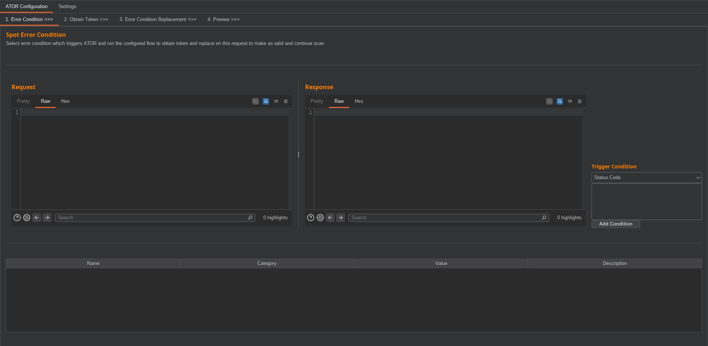
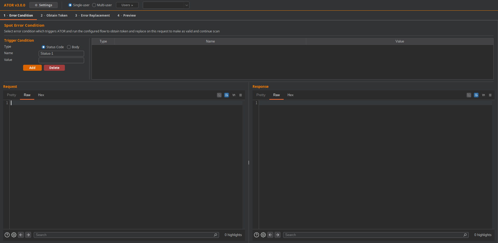
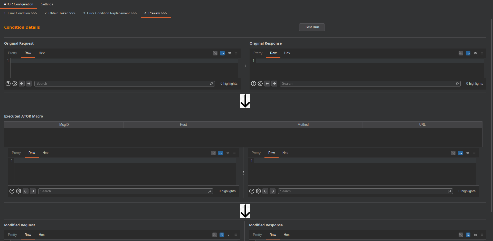
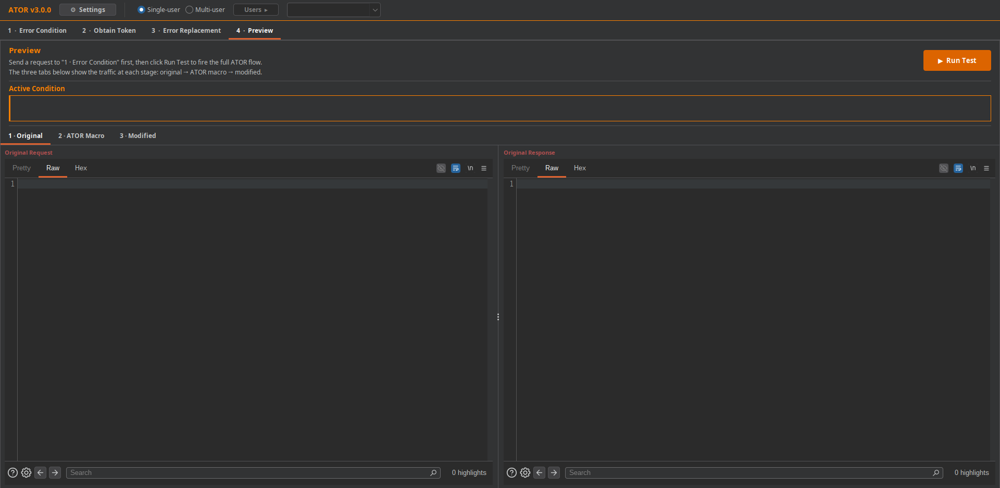
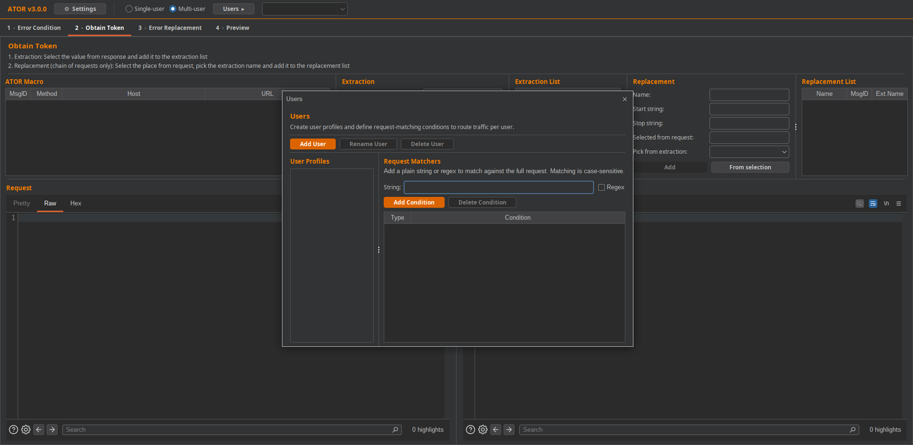

# Pending changes

- **Added multi-user feature:**  
User profile management with per-user request matchers, saved profile snapshots, and a dedicated Users tab for creating, renaming, deleting, and switching profiles.
- **Heavily enhanced UI/UX:**  
Updated the error, obtain, replace, preview, and settings flows to work with the new profile system, with smoother profile-aware behavior across the app.
- **Extended import/export:**  
Configuration now includes users, the active user, and UI state.

### Screenshots
#### Error Condition Panel
***Before***

***After***

#### Preview Panel
***Before***

***After***

#### User Management Panel
